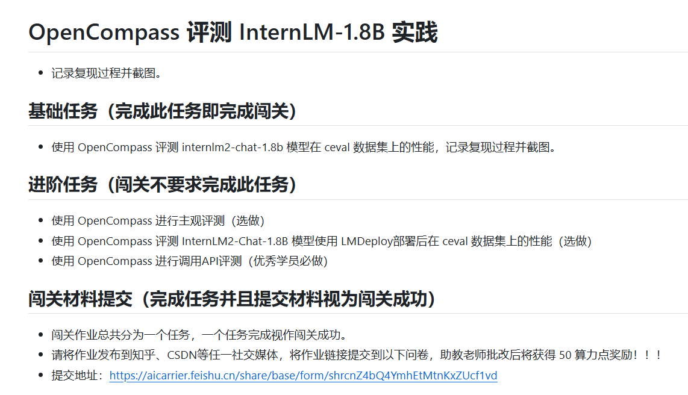
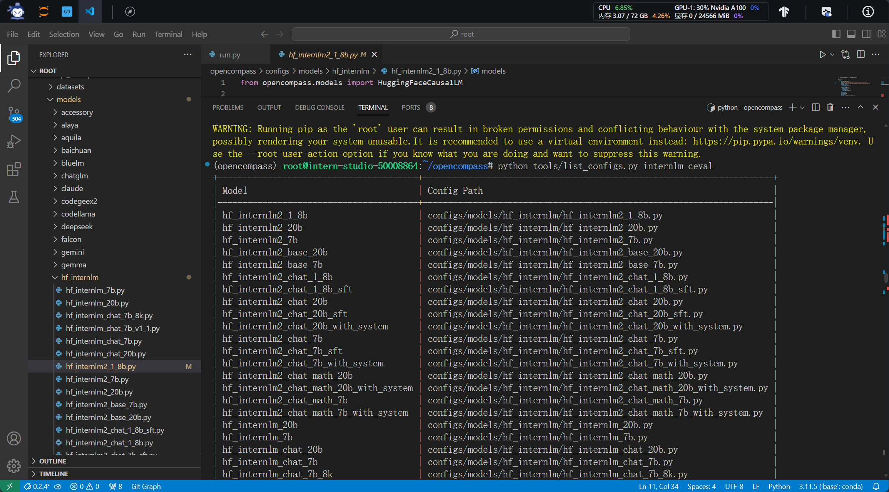
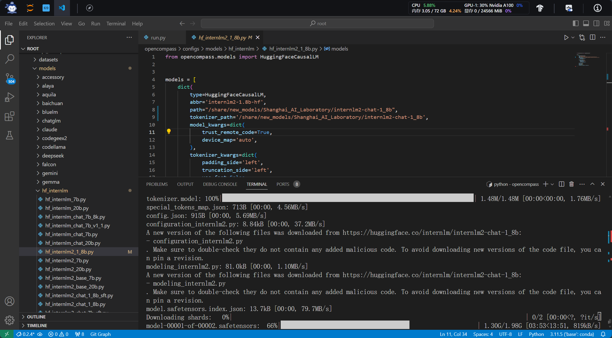
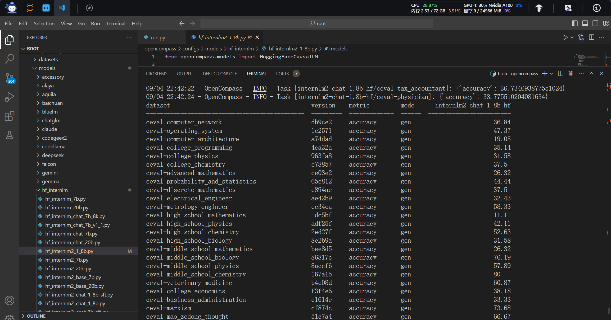

# 参考文档

[Tutorial/docs/L1/OpenCompass at camp3 · InternLM/Tutorial (github.com)](https://github.com/InternLM/Tutorial/tree/camp3/docs/L1/OpenCompass)

# 任务内容



# 任务复现过程

列出所有跟 InternLM 及 C-Eval 相关的配置：

```BASH
python tools/list_configs.py internlm ceval
```





==评测结束==

